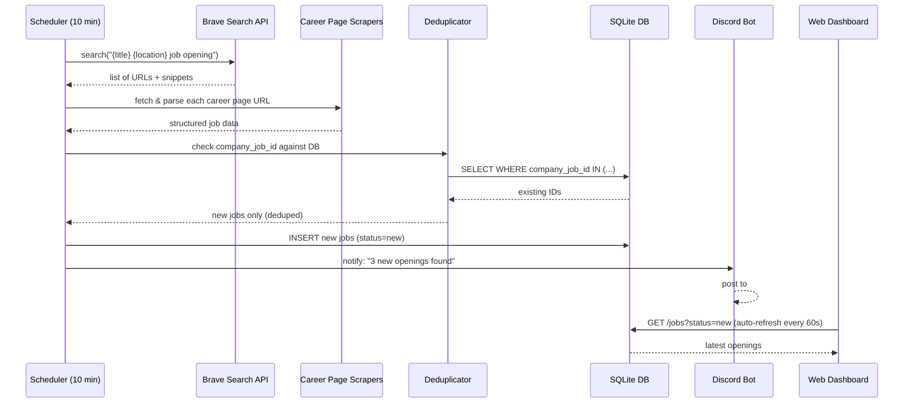
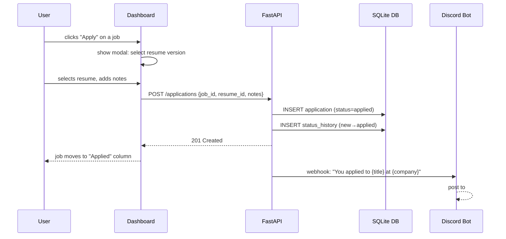
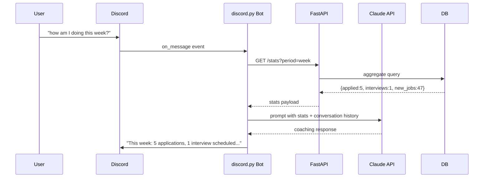

# Architecture & Data Flow

## System Overview

```
┌─────────────────────────────────────────────────────────────────────┐
│                         INTERNET                                    │
│   Google Jobs · LinkedIn · Greenhouse · Lever · Workday · FAANG     │
│                    company career pages                             │
└──────────────────────────────┬──────────────────────────────────────┘
                               │  HTTP (every 10 min)
                               ▼
┌──────────────────────────────────────────────────────────────────────┐
│                        SCRAPER SERVICE                               │
│                                                                      │
│   BraveSearchClient ──► query("{title} {location} job -site:linkedin)│
│   CareerPageScraper ──► direct HTML parsing of company /careers pages│
│   Deduplicator      ──► company_job_id + url hash check against DB   │
│   Normalizer        ──► extract: title, company, level, location,    │
│                         posted_at, job_id, url                       │
└──────────────────────────────┬───────────────────────────────────────┘
                               │  INSERT new jobs only
                               ▼
┌──────────────────────────────────────────────────────────────────────┐
│                         SQLite DATABASE                              │
│                                                                      │
│   jobs ◄──────────────── applications ◄────── status_history        │
│                               │                                      │
│                          interviews                                  │
│                                                                      │
│   resumes (JSON blobs)    search_config    discord_sessions          │
└──────────┬────────────────────┬────────────────────────────────────-─┘
           │                    │
           ▼                    ▼
┌──────────────────┐   ┌────────────────────────────────────────────┐
│   FastAPI        │   │   DISCORD BOT                              │
│                  │   │                                            │
│  /jobs           │   │   #job-hunt channel                        │
│  /applications   │   │   • new job alerts (on discovery)          │
│  /interviews     │   │   • conversational partner                 │
│  /resumes        │   │   • interview prep on demand               │
│  /config         │   │   • calls Claude API for responses         │
│  /stats          │   │   • reads/writes DB via internal API       │
└────────┬─────────┘   └────────────────────────────────────────────┘
         │
         ▼
┌──────────────────────────────────────────────────────────────────────┐
│                       WEB DASHBOARD                                  │
│                                                                      │
│  ┌─────────────┐  ┌──────────────────┐  ┌─────────────────────┐    │
│  │  Job Board  │  │  Pipeline Tracker│  │  Stats & Progress   │    │
│  │             │  │                  │  │                     │    │
│  │ All openings│  │  Kanban: new →   │  │  Applied: 12        │    │
│  │ matching    │  │  applied →       │  │  Interviews: 3      │    │
│  │ your config │  │  screen →        │  │  Offers: 0          │    │
│  │             │  │  interview →     │  │  Goal: 5/day        │    │
│  │ [Save] [X]  │  │  offer/rejected  │  │  Days left: 58      │    │
│  └─────────────┘  └──────────────────┘  └─────────────────────┘    │
└──────────────────────────────────────────────────────────────────────┘
```

## Data Flow: New Job Discovery



## Data Flow: Applying to a Job



## Data Flow: Discord Coaching Interaction



## Scheduler Timeline

```
:00  ─── scraper runs ──► check Brave Search + career pages
:10  ─── scraper runs
:20  ─── scraper runs
...
09:00 ── daily morning summary pushed to Discord
18:00 ── evening check-in if < N applications today
```

## Deployment Topology (DigitalOcean Droplet)

```
Internet
   │
   ▼
nginx (port 80/443)
   ├── /jobs-dashboard  ──► static files (src/dashboard/)
   └── /api             ──► FastAPI (uvicorn, port 5057)
                               ├── APScheduler (runs in-process)
                               └── SQLite (jobs.db)

systemd services:
   job-hunter-api.service    ← FastAPI + scheduler
   claude-discord-bot.service ← existing, extended with job-hunt module
```
