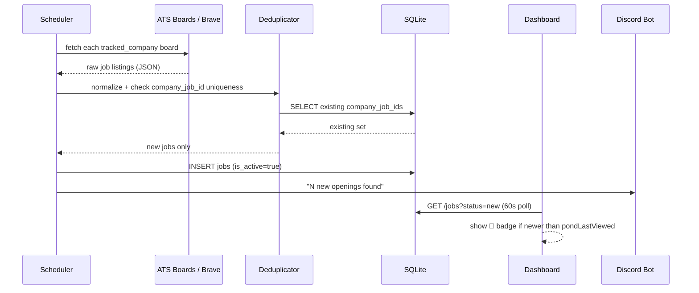
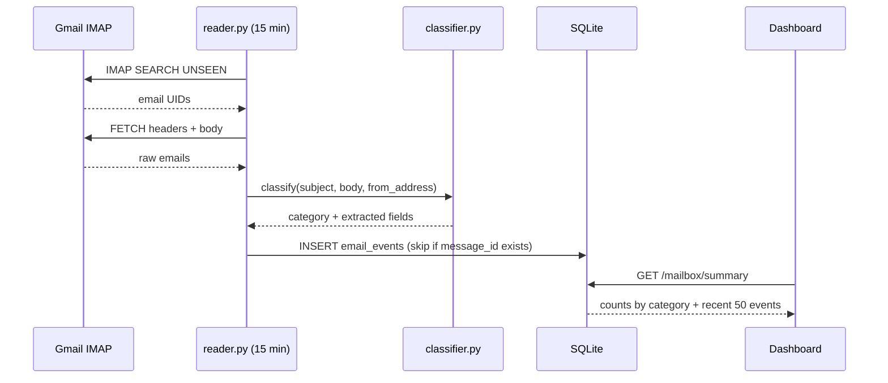
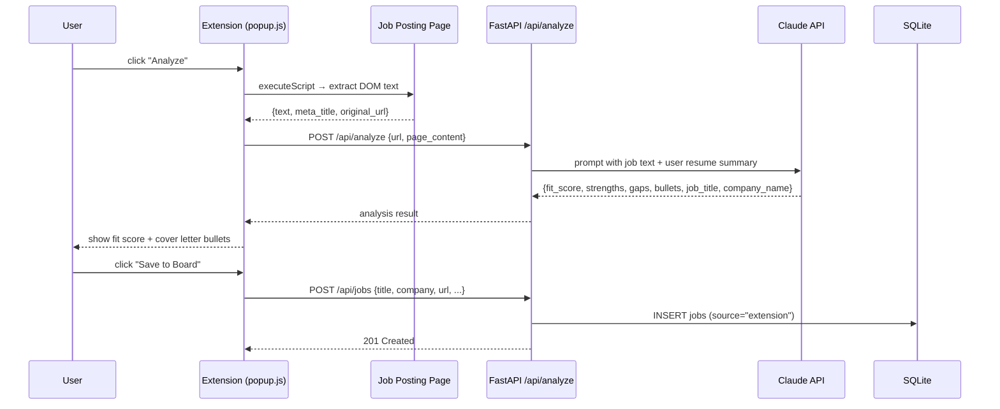

# Architecture & System Design

## System Overview

```
┌──────────────────────────────────────────────────────────────────────────┐
│                              INTERNET                                    │
│  LinkedIn · Greenhouse · Lever · Ashby · Workday · SmartRecruiters       │
│  Amazon Jobs · Google Careers · Brave Search API · Gmail IMAP            │
└────────────────────────────────┬─────────────────────────────────────────┘
                                 │
          ┌──────────────────────┼──────────────────────┐
          ▼                      ▼                      ▼
┌──────────────────┐  ┌──────────────────────┐  ┌──────────────────┐
│  CAREER-PAGE     │  │  LINKEDIN SCRAPER     │  │  EMAIL READER    │
│  SCRAPER (30min) │  │  (every 5 min)        │  │  (every 15 min)  │
│                  │  │                       │  │                  │
│ ATS boards:      │  │ LinkedIn Jobs search  │  │ Gmail IMAP       │
│ Greenhouse       │  │ filtered by geoId +   │  │ → classify →     │
│ Lever            │  │ f_TPR=r300 (last 5m)  │  │ email_events     │
│ Ashby            │  └──────────┬────────────┘  └──────┬───────────┘
│ Workday          │             │                       │
│ SmartRecruiters  │             │                       │
│ Amazon           │             │                       │
│ Brave Web Search │             │                       │
└────────┬─────────┘             │                       │
         │                       │                       │
         └──────────────┬────────┘                       │
                        ▼                                │
         ┌──────────────────────────┐                    │
         │  DEDUPLICATOR &          │                    │
         │  NORMALIZER              │                    │
         │                          │                    │
         │  • company_job_id + url  │                    │
         │    hash uniqueness check │                    │
         │  • extract: title,       │                    │
         │    company, level,       │                    │
         │    location, posted_at   │                    │
         └──────────┬───────────────┘                    │
                    │ INSERT new jobs only                │
                    ▼                                     ▼
┌─────────────────────────────────────────────────────────────────────────┐
│                           SQLite DATABASE  (jobs.db)                    │
│                                                                         │
│  jobs ──────────────► applications ──────► status_history              │
│       ◄── tracked_companies (scraper targets)    │                      │
│                           │                      └──► interviews        │
│  email_events ────────────┘ (linked_application_id)                    │
│  resumes ─────────────────► applications                                │
│  search_config             discord_sessions                             │
└────────────┬──────────────────────────────────────────────────────────-─┘
             │
    ┌────────┼────────────────────────┐
    ▼        ▼                        ▼
┌────────┐ ┌──────────────────┐  ┌───────────────────────────────────┐
│FastAPI │ │  DISCORD BOT     │  │  BROWSER EXTENSION (Duck Hunt)    │
│        │ │                  │  │                                   │
│/jobs   │ │  #claude channel │  │  Manifest V3 · Chrome/Edge/Arc    │
│/apps   │ │  • morning brief │  │                                   │
│/stats  │ │  • evening check │  │  • "Analyze" any job posting:     │
│/config │ │  • daily report  │  │    extracts DOM text → POST       │
│/mailbox│ │  • conversational│  │    /api/analyze → Claude fit      │
│/msgs   │ │    coaching via  │  │    score + cover letter bullets   │
│/co's   │ │    Claude API    │  │  • "Quick Add" to board w/out     │
│/portal │ │  • reads DB via  │  │    analysis                       │
│/learn  │ │    internal API  │  │  • "Save to Board" after analyze  │
│/analyze│ └──────────────────┘  │  • configurable server URL        │
└───┬────┘                       └───────────────────────────────────┘
    │
    ▼
┌─────────────────────────────────────────────────────────────────────────┐
│                          WEB DASHBOARD                                  │
│  Sidebar navigation (position: fixed, 210px)                            │
│                                                                         │
│  ┌──────────┬──────────┬─────────┬──────────┬───────────┬───────────┐  │
│  │The Pond  │ My Shots │ Mailbox │ Messages │ Analysis  │ Companies │  │
│  │          │          │         │          │           │           │  │
│  │Job board │Pipeline  │Email    │LinkedIn  │Line chart │Tracked    │  │
│  │new jobs  │tracker   │events   │DMs       │apps/day   │companies  │  │
│  │🦆 badge  │sortable  │by cat.  │from Gmail│7d avg     │+ portal   │  │
│  │on new    │table     │         │IMAP      │funnel     │           │  │
│  └──────────┴──────────┴─────────┴──────────┴───────────┴───────────┘  │
└─────────────────────────────────────────────────────────────────────────┘
```

## Component Breakdown

### Scraper Engine (`src/scraper/`)

| Module | Purpose | Schedule |
|---|---|---|
| `engine.py` | Orchestrates all ATS board scrapers | Every 30 min |
| `boards.py` | Greenhouse, Lever, Ashby, Workday, SmartRecruiters, Amazon | — |
| `brave.py` | Brave Search API fallback for companies without known ATS | Every 30 min |
| `career_pages.py` | HTML parser for direct company career pages | Every 30 min |
| `web_search.py` | Discovers new companies via Brave + Claude | Daily 2 AM |
| `validator.py` | Checks job links still live (marks `is_active=false`) | Every 4 hrs |

**ATS board scraping** — direct JSON API calls to each platform's internal job listing endpoint. No browser automation needed; these endpoints are public and fast:
- Greenhouse: `https://boards-api.greenhouse.io/v1/boards/{slug}/jobs`
- Lever: `https://api.lever.co/v0/postings/{slug}`
- Ashby: `https://api.ashbyhq.com/posting-public/jobBoard/{slug}`
- Workday: `https://{slug}.myworkdayjobs.com/wday/cxs/{slug}/{board}/jobs`
- SmartRecruiters: `https://api.smartrecruiters.com/v1/companies/{slug}/postings`
- Amazon: `https://www.amazon.jobs/en/search.json`

### Email Integration (`src/email/`)

| Module | Purpose |
|---|---|
| `reader.py` | Gmail IMAP polling — fetches unseen emails, calls classifier, writes `email_events` |
| `classifier.py` | Rules-based categorizer — detects rejections, offers, interviews, LinkedIn DMs, confirmations |

**LinkedIn DM detection** — LinkedIn sends email notifications from `messages-noreply@linkedin.com` when someone messages you. The classifier detects these by sender address + subject pattern ("sent you a message", "new InMail from", etc.), extracts the sender name from the subject line, and stores the message preview from the email body after stripping the boilerplate footer. These appear in the dedicated **Messages** tab.

**Email categories:**

| Category | Detection trigger |
|---|---|
| `rejection` | Keywords: "unfortunately", "other candidates", "not moving forward" |
| `offer` | Keywords: "offer letter", "pleased to offer", "compensation package" |
| `interview` | Keywords: "interview", "schedule", "calendar invite" |
| `assessment` | Keywords: "coding challenge", "take-home", "HackerRank" |
| `application_confirm` | Keywords: "received your application", "thank you for applying" |
| `linkedin_message` | Sender: `messages-noreply@linkedin.com` + subject pattern |
| `other` | Everything else |

### Learning Pass (`src/api/learning.py`)

Runs hourly. Reads user feedback stored on job records (`user_feedback`, `feedback_at`) and updates the scraper's scoring/filtering preferences. Allows the system to learn which types of roles the user actually wants to apply to over time.

### Company Portal (`src/portal/`)

Handles the "Add Company" flow in the dashboard. Accepts a company name, URL, or ATS shorthand (`greenhouse:stripe`, `workday:cisco/Cisco_Careers`) and resolves it to a `TrackedCompany` record that the scraper will then poll on every cycle.

### Browser Extension (`extension/`)

Manifest V3 Chrome/Edge/Arc extension. Two entry points:

**Analyze flow:**
1. User clicks extension on a job posting page
2. Extension runs `chrome.scripting.executeScript` to extract DOM text (handles login-gated content since it runs in the page context)
3. Sends `POST /api/analyze` with page text + URL
4. Server calls Claude API: returns `fit_score`, `strengths`, `gaps`, `cover_letter_bullets`, parsed `job_title`, `company_name`, `location`, `level`
5. Extension renders results; user can "Save to Board" (calls `POST /api/jobs`)

**Quick Add flow:**  
Skips analysis; pre-fills title/company from page `<meta>` tags. User edits and confirms → `POST /api/jobs` directly.

The extension stores the server URL (default `http://143.198.134.85`) in `chrome.storage.local` for easy reconfiguration.

### Dashboard (`src/dashboard/`)

Single-page app — vanilla HTML/CSS/JS, no framework. Served as static files by nginx.

**Layout:** `body { display: flex; flex-direction: row }` — sidebar is a natural flex child (`width: 210px; flex-shrink: 0`), main content takes `flex: 1`. Critical layout rules live in an inline `<style>` block to prevent Edge CSS caching issues.

**New-jobs duck badge:** On each 60s polling tick (when not on The Pond tab), the dashboard fetches the newest job's `discovered_at` and compares against the `pondLastViewed` timestamp stored in `localStorage`. If a newer job exists, a glowing 🦆 appears next to "The Pond" nav item. Cleared on tab visit.

**Tabs:**

| Tab | Key features |
|---|---|
| The Pond | Job board, search/filter, apply modal, Sort by discovered/title/company, 🦆 badge |
| My Shots | Sortable application table (title/company/date/status), status update modal |
| Mailbox | Email event feed grouped by category, counts by week |
| Messages | LinkedIn DMs parsed from Gmail IMAP notifications |
| Analysis | Line chart: applications/day + 7-day rolling average, status funnel, source breakdown, top companies |
| Companies | Tracked company list + ATS portal input |
| Settings | Search config (titles, locations, levels, keywords, exclusions) |

### Discord Bot (`src/discord/`)

Scheduled notifications push to the `#claude` channel (Moon Station server). The bot also handles conversational messages — each reply calls the Claude API with conversation history from `discord_sessions`.

**Scheduled notifications:**

| Time | Message |
|---|---|
| 09:00 | Morning summary — new jobs found overnight, pipeline counts, today's target |
| 18:00 | Evening check-in — how many applied today vs target, nudge if behind |
| 21:00 | Daily report — jobs found today, calls to action |

## Scheduler Timeline

```
Every 5 min  ── LinkedIn poll (last-5-min filter, SF Bay Area geoId)
Every 15 min ── Gmail IMAP email sync
Every 30 min ── Career-page + ATS board scraper
Every 60 min ── Learning pass (user feedback → preference update)
 01:00       ── Job link validator pass (~50 jobs)
 02:00       ── Company auto-discovery (Brave + Claude)
 05:00       ── Job link validator pass
 09:00       ── Morning Discord summary
 09:00       ── Job link validator pass
 13:00       ── Job link validator pass
 17:00       ── Job link validator pass
 18:00       ── Evening Discord check-in
 21:00       ── Daily Discord report + job link validator pass
```

## Deployment Topology (DigitalOcean SFO3)

```
Internet (port 80/443)
         │
         ▼
      nginx
         ├── /jobs-dashboard  ─► static files  (src/dashboard/)
         └── /api             ─► uvicorn :5057
                                    │
                                    ├── FastAPI app
                                    ├── APScheduler (in-process, asyncio)
                                    └── SQLite  (jobs.db, single writer)

systemd services:
  job-hunter.service            ← FastAPI + APScheduler
  claude-discord-bot.service    ← Discord bot (relays to Claude Code CLI)
```

**Server:** ubuntu-s-1vcpu-1gb-sfo3 · Ubuntu 24.04.3 LTS · 2 vCPU · 3.8 GB RAM · 77 GB disk

SQLite is adequate for this workload (single user, < 10k rows). The single-writer model is safe because all DB writes go through the FastAPI process (APScheduler runs in the same process).

## Data Flow: New Job Discovery



## Data Flow: Email → Mailbox Tab



## Data Flow: Extension → Board


