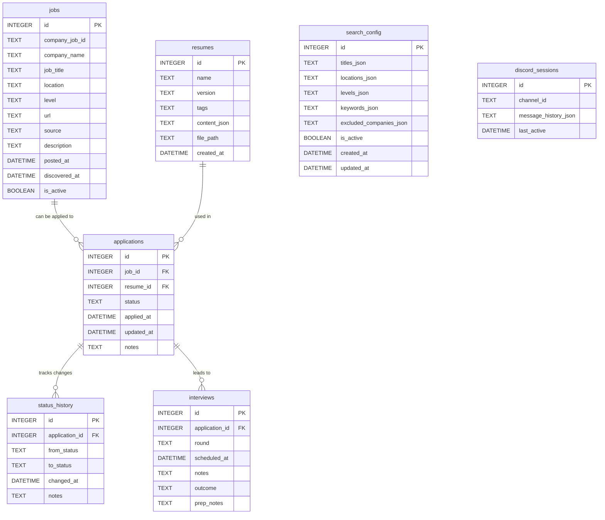

# Database Schema

SQLite database at `/opt/job-hunt-partner/jobs.db`.
JSON columns use SQLite's native JSON support (available since 3.38).

---

## Entity Relationship Diagram



---

## Table Definitions (DDL)

### `jobs`
Master list of all discovered openings. Never deleted — `is_active` flips to false when a posting disappears.

```sql
CREATE TABLE jobs (
    id              INTEGER PRIMARY KEY AUTOINCREMENT,
    company_job_id  TEXT NOT NULL,          -- company's own ID (from URL or page)
    company_name    TEXT NOT NULL,
    job_title       TEXT NOT NULL,
    location        TEXT,
    level           TEXT,                   -- "Senior", "L4", "IC3", etc.
    url             TEXT NOT NULL,
    source          TEXT NOT NULL,          -- "brave_search", "google_careers", etc.
    description     TEXT,
    posted_at       DATETIME,               -- when company listed it (NULL if unknown)
    discovered_at   DATETIME NOT NULL DEFAULT (datetime('now')),
    is_active       BOOLEAN NOT NULL DEFAULT 1,
    UNIQUE(company_job_id, source)          -- deduplication constraint
);

CREATE INDEX idx_jobs_discovered ON jobs(discovered_at DESC);
CREATE INDEX idx_jobs_company ON jobs(company_name);
CREATE INDEX idx_jobs_active ON jobs(is_active);
```

### `applications`
Tracks jobs you have decided to apply for. One row per job application.

```sql
CREATE TABLE applications (
    id          INTEGER PRIMARY KEY AUTOINCREMENT,
    job_id      INTEGER NOT NULL REFERENCES jobs(id),
    resume_id   INTEGER REFERENCES resumes(id),
    status      TEXT NOT NULL DEFAULT 'applied'
                    CHECK(status IN (
                        'saved',        -- interested, not applied yet
                        'applied',      -- submitted
                        'phone_screen', -- recruiter call scheduled/done
                        'interview',    -- technical/behavioral rounds
                        'offer',        -- received an offer
                        'rejected',     -- rejected at any stage
                        'withdrawn'     -- you withdrew
                    )),
    applied_at  DATETIME,               -- NULL if status='saved'
    updated_at  DATETIME NOT NULL DEFAULT (datetime('now')),
    notes       TEXT
);

CREATE INDEX idx_applications_status ON applications(status);
CREATE INDEX idx_applications_job ON applications(job_id);
```

### `status_history`
Immutable audit log of every status change on an application.

```sql
CREATE TABLE status_history (
    id              INTEGER PRIMARY KEY AUTOINCREMENT,
    application_id  INTEGER NOT NULL REFERENCES applications(id),
    from_status     TEXT,               -- NULL for first entry
    to_status       TEXT NOT NULL,
    changed_at      DATETIME NOT NULL DEFAULT (datetime('now')),
    notes           TEXT
);
```

### `interviews`
One row per interview round. An application can have multiple rounds.

```sql
CREATE TABLE interviews (
    id              INTEGER PRIMARY KEY AUTOINCREMENT,
    application_id  INTEGER NOT NULL REFERENCES applications(id),
    round           TEXT NOT NULL
                        CHECK(round IN (
                            'phone_screen',
                            'technical',
                            'behavioral',
                            'system_design',
                            'take_home',
                            'final',
                            'other'
                        )),
    scheduled_at    DATETIME,
    notes           TEXT,               -- your notes during/after
    outcome         TEXT
                        CHECK(outcome IN (
                            'passed', 'failed', 'pending', 'cancelled'
                        )),
    prep_notes      TEXT                -- interview prep material, Claude suggestions
);
```

### `resumes`
NoSQL-style flexible resume storage. `content_json` stores structured resume data as a JSON document. `file_path` optionally points to the raw PDF/DOCX.

```sql
CREATE TABLE resumes (
    id              INTEGER PRIMARY KEY AUTOINCREMENT,
    name            TEXT NOT NULL,      -- e.g. "SWE Backend v3"
    version         TEXT,               -- semver or free-form
    tags            TEXT,               -- JSON array: ["backend","python","senior"]
    content_json    TEXT,               -- full resume as JSON document (see below)
    file_path       TEXT,               -- /opt/job-hunt-partner/resumes/swe-v3.pdf
    created_at      DATETIME NOT NULL DEFAULT (datetime('now'))
);
```

**`content_json` document structure:**
```json
{
  "summary": "...",
  "experience": [
    {
      "company": "Acme Corp",
      "title": "Senior Software Engineer",
      "start": "2022-01",
      "end": "2024-12",
      "bullets": ["...", "..."]
    }
  ],
  "education": [
    { "school": "...", "degree": "...", "year": 2020 }
  ],
  "skills": ["Python", "Go", "Kubernetes"],
  "links": {
    "github": "https://github.com/...",
    "linkedin": "https://linkedin.com/in/..."
  }
}
```

### `search_config`
User's job search preferences. Only one row should have `is_active=1` at a time.

```sql
CREATE TABLE search_config (
    id                      INTEGER PRIMARY KEY AUTOINCREMENT,
    titles_json             TEXT NOT NULL DEFAULT '[]',
    -- e.g. ["Software Engineer", "Backend Engineer", "SWE"]
    locations_json          TEXT NOT NULL DEFAULT '[]',
    -- e.g. ["San Francisco", "New York", "Remote"]
    levels_json             TEXT NOT NULL DEFAULT '[]',
    -- e.g. ["Senior", "Staff", "L5", "L6"]
    keywords_json           TEXT NOT NULL DEFAULT '[]',
    -- additional search terms: ["distributed systems", "Python"]
    excluded_companies_json TEXT NOT NULL DEFAULT '[]',
    -- companies to skip: ["Company X"]
    is_active               BOOLEAN NOT NULL DEFAULT 1,
    created_at              DATETIME NOT NULL DEFAULT (datetime('now')),
    updated_at              DATETIME NOT NULL DEFAULT (datetime('now'))
);
```

### `discord_sessions`
Stores per-channel conversation history for the Discord bot so it has memory within a session.

```sql
CREATE TABLE discord_sessions (
    id                  INTEGER PRIMARY KEY AUTOINCREMENT,
    channel_id          TEXT NOT NULL UNIQUE,
    message_history_json TEXT NOT NULL DEFAULT '[]',
    -- JSON array of {role, content, timestamp} objects
    -- kept to last 20 messages to manage token count
    last_active         DATETIME NOT NULL DEFAULT (datetime('now'))
);
```

---

## Status State Machine

```
                    ┌─────────┐
                    │  saved  │ ◄── user bookmarks a job
                    └────┬────┘
                         │ user applies
                         ▼
                    ┌─────────┐
                    │ applied │
                    └────┬────┘
                         │ recruiter reaches out
                         ▼
                  ┌──────────────┐
                  │ phone_screen │
                  └──────┬───────┘
                         │ passes screen
                         ▼
                  ┌──────────────┐
                  │  interview   │ ◄── multiple rounds (see interviews table)
                  └──────┬───────┘
                         │
              ┌──────────┴──────────┐
              ▼                     ▼
          ┌───────┐           ┌──────────┐
          │ offer │           │ rejected │
          └───────┘           └──────────┘

  withdrawn ◄── can exit from any state
```

---

## Key Indexes & Query Patterns

| Query | Index Used |
|---|---|
| New jobs since last visit | `idx_jobs_discovered` |
| Jobs by company | `idx_jobs_company` |
| Active applications | `idx_applications_status` |
| Application history for a job | `idx_applications_job` |
| Deduplication on insert | `UNIQUE(company_job_id, source)` |
