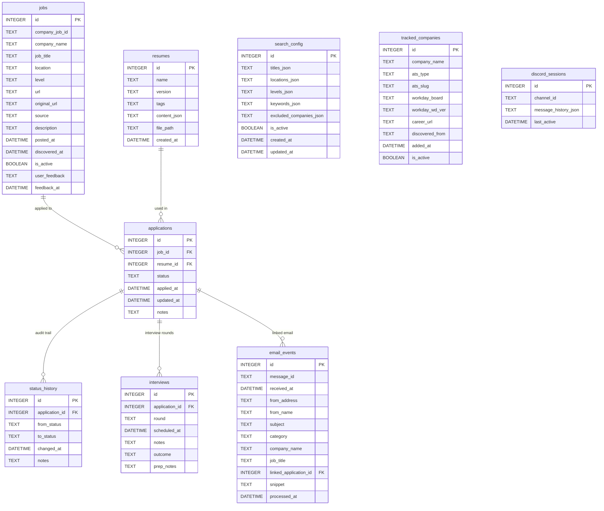

# Database Schema

SQLite database at `/opt/job-hunt-partner/jobs.db`.

---

## Entity Relationship Diagram



---

## Table Definitions

### `jobs`
Master list of every job opening discovered by the scraper or added manually/via extension. Records are never deleted — `is_active` flips to `false` when the posting disappears.

```sql
CREATE TABLE jobs (
    id              INTEGER PRIMARY KEY AUTOINCREMENT,
    company_job_id  TEXT NOT NULL,      -- platform's own job ID (from URL or API)
    company_name    TEXT NOT NULL,
    job_title       TEXT NOT NULL,
    location        TEXT,
    level           TEXT,               -- "Senior", "L4", "New Grad", etc.
    url             TEXT NOT NULL,      -- source URL (LinkedIn, ATS board, etc.)
    original_url    TEXT,               -- company's own career page URL (when different)
    source          TEXT NOT NULL,      -- "greenhouse", "lever", "linkedin", "brave_search", "extension", etc.
    description     TEXT,
    posted_at       DATETIME,           -- company's posted date (NULL if not available)
    discovered_at   DATETIME NOT NULL DEFAULT (datetime('now')),
    is_active       BOOLEAN NOT NULL DEFAULT 1,
    user_feedback   TEXT,               -- free-text feedback for learning pass
    feedback_at     DATETIME,           -- when feedback was recorded
    UNIQUE(company_job_id, source)      -- deduplication constraint
);

CREATE INDEX idx_jobs_discovered ON jobs(discovered_at DESC);
CREATE INDEX idx_jobs_company    ON jobs(company_name);
CREATE INDEX idx_jobs_active     ON jobs(is_active);
```

**`source` values:** `greenhouse`, `lever`, `ashby`, `workday`, `smartrecruiters`, `amazon`, `linkedin`, `brave_search`, `extension`, `manual`

**`original_url` vs `url`:** `url` is always the page the scraper or extension found the job on. When the extension detects an ATS link embedded on a third-party page (e.g. LinkedIn → Greenhouse), `original_url` holds the ATS link so the dashboard can deep-link directly to the company's application form.

---

### `applications`
One row per job application. Status tracks the current stage in the hiring pipeline.

```sql
CREATE TABLE applications (
    id          INTEGER PRIMARY KEY AUTOINCREMENT,
    job_id      INTEGER NOT NULL REFERENCES jobs(id),
    resume_id   INTEGER REFERENCES resumes(id),
    status      TEXT NOT NULL DEFAULT 'applied'
                    CHECK(status IN (
                        'saved',        -- bookmarked, not yet applied
                        'applied',      -- submitted
                        'phone_screen', -- recruiter call
                        'interview',    -- technical / behavioral rounds
                        'offer',        -- received an offer
                        'rejected',     -- rejected at any stage
                        'withdrawn'     -- candidate withdrew
                    )),
    applied_at  DATETIME,               -- NULL when status='saved'
    updated_at  DATETIME NOT NULL DEFAULT (datetime('now')),
    notes       TEXT
);

CREATE INDEX idx_applications_status ON applications(status);
CREATE INDEX idx_applications_job    ON applications(job_id);
```

---

### `status_history`
Append-only audit log of every status transition. Written automatically by the API on every `PATCH /applications/{id}`.

```sql
CREATE TABLE status_history (
    id              INTEGER PRIMARY KEY AUTOINCREMENT,
    application_id  INTEGER NOT NULL REFERENCES applications(id),
    from_status     TEXT,               -- NULL for the initial entry
    to_status       TEXT NOT NULL,
    changed_at      DATETIME NOT NULL DEFAULT (datetime('now')),
    notes           TEXT
);
```

---

### `interviews`
One row per interview round. An application can have many rounds.

```sql
CREATE TABLE interviews (
    id              INTEGER PRIMARY KEY AUTOINCREMENT,
    application_id  INTEGER NOT NULL REFERENCES applications(id),
    round           TEXT NOT NULL
                        CHECK(round IN (
                            'phone_screen', 'technical', 'behavioral',
                            'system_design', 'take_home', 'final', 'other'
                        )),
    scheduled_at    DATETIME,
    notes           TEXT,               -- notes during or after the interview
    outcome         TEXT
                        CHECK(outcome IN ('passed', 'failed', 'pending', 'cancelled')),
    prep_notes      TEXT                -- Claude-generated prep material
);
```

---

### `resumes`
Flexible resume storage. `content_json` stores structured resume data; `file_path` optionally points to the raw PDF/DOCX stored in `uploads/`.

```sql
CREATE TABLE resumes (
    id           INTEGER PRIMARY KEY AUTOINCREMENT,
    name         TEXT NOT NULL,         -- e.g. "Data Engineering v3"
    version      TEXT,                  -- semver or free-form label
    tags         TEXT DEFAULT '[]',     -- JSON array: ["python","dbt","senior"]
    content_json TEXT DEFAULT '{}',     -- full resume as JSON (see structure below)
    file_path    TEXT,                  -- /opt/job-hunt-partner/uploads/resume-v3.pdf
    created_at   DATETIME NOT NULL DEFAULT (datetime('now'))
);
```

**`content_json` document structure:**
```json
{
  "summary": "...",
  "experience": [
    {
      "company": "Acme Corp",
      "title": "Senior Data Engineer",
      "start": "2022-01",
      "end": "2024-12",
      "bullets": ["Built X that did Y", "..."]
    }
  ],
  "education": [{ "school": "...", "degree": "...", "year": 2020 }],
  "skills": ["Python", "dbt", "Spark", "Airflow"],
  "links": {
    "github":   "https://github.com/...",
    "linkedin": "https://linkedin.com/in/..."
  }
}
```

---

### `search_config`
User's job search preferences. The scraper reads the row where `is_active=1` on every run. Only one active row at a time.

```sql
CREATE TABLE search_config (
    id                      INTEGER PRIMARY KEY AUTOINCREMENT,
    titles_json             TEXT NOT NULL DEFAULT '[]',
    -- ["Data Engineer", "Analytics Engineer", "ML Engineer"]
    locations_json          TEXT NOT NULL DEFAULT '[]',
    -- ["San Francisco", "Remote", "New York"]
    levels_json             TEXT NOT NULL DEFAULT '[]',
    -- ["Senior", "Staff", "L5"]
    keywords_json           TEXT NOT NULL DEFAULT '[]',
    -- ["dbt", "Spark", "Python"]
    excluded_companies_json TEXT NOT NULL DEFAULT '[]',
    -- companies to skip entirely
    is_active               BOOLEAN NOT NULL DEFAULT 1,
    created_at              DATETIME NOT NULL DEFAULT (datetime('now')),
    updated_at              DATETIME NOT NULL DEFAULT (datetime('now'))
);
```

---

### `tracked_companies`
Master list of companies the scraper polls on every career-page cycle. Populated via the Companies tab portal, seed script, or automated discovery.

```sql
CREATE TABLE tracked_companies (
    id              INTEGER PRIMARY KEY AUTOINCREMENT,
    company_name    TEXT NOT NULL,
    ats_type        TEXT NOT NULL,
    -- greenhouse | lever | ashby | workday | smartrecruiters | amazon | custom
    ats_slug        TEXT NOT NULL,
    -- ATS-specific tenant identifier (e.g. "stripe" for Greenhouse, "stripe" for Lever)
    workday_board   TEXT,
    -- Workday board path, e.g. "Cisco_Careers" (Workday only)
    workday_wd_ver  TEXT DEFAULT 'wd5',
    -- Workday data-center version: wd1 | wd5 | wd12 (Workday only)
    career_url      TEXT,
    -- canonical career homepage URL for reference
    discovered_from TEXT NOT NULL DEFAULT 'manual',
    -- manual | seed | auto (auto = found by company_discovery job)
    added_at        DATETIME NOT NULL DEFAULT (datetime('now')),
    is_active       BOOLEAN NOT NULL DEFAULT 1
);
```

**ATS slug examples:**

| ATS | Company | `ats_slug` | `workday_board` |
|---|---|---|---|
| Greenhouse | Stripe | `stripe` | — |
| Lever | Figma | `figma` | — |
| Ashby | Linear | `linear` | — |
| Workday | Cisco | `cisco` | `Cisco_Careers` |
| Workday | Microsoft | `microsoft` | `microsoftcareers` |
| SmartRecruiters | KPMG | `KPMG` | — |
| Amazon | Amazon | `amazon` | — |

---

### `email_events`
Every email processed by the Gmail IMAP reader. Deduplicated by `message_id`. Used to power the Mailbox tab and Messages tab (LinkedIn DMs).

```sql
CREATE TABLE email_events (
    id                      INTEGER PRIMARY KEY AUTOINCREMENT,
    message_id              TEXT UNIQUE NOT NULL,   -- RFC 2822 Message-ID header
    received_at             DATETIME,
    from_address            TEXT,
    from_name               TEXT,
    subject                 TEXT,
    category                TEXT NOT NULL DEFAULT 'other',
    -- offer | interview | assessment | rejection |
    -- application_confirm | linkedin_message | other
    company_name            TEXT,
    -- for linkedin_message: stores the sender's name (from subject parsing)
    job_title               TEXT,
    linked_application_id   INTEGER REFERENCES applications(id),
    -- matched to an application by company name (fuzzy)
    snippet                 TEXT,
    -- for linkedin_message: cleaned message preview (first ~250 chars)
    -- for others: first 250 chars of email body
    processed_at            DATETIME NOT NULL
);

CREATE INDEX idx_email_events_received  ON email_events(received_at DESC);
CREATE INDEX idx_email_events_category  ON email_events(category);
```

**LinkedIn DM storage note:** Because `email_events` was designed for job emails, LinkedIn DMs reuse existing columns: `company_name` stores the sender's display name (parsed from the subject line), and `snippet` stores the message preview (first paragraph of the email body, footer stripped).

---

### `discord_sessions`
Per-channel conversation history for the Discord bot. Kept to the last 20 messages to control Claude API token usage.

```sql
CREATE TABLE discord_sessions (
    id                   INTEGER PRIMARY KEY AUTOINCREMENT,
    channel_id           TEXT NOT NULL UNIQUE,
    message_history_json TEXT NOT NULL DEFAULT '[]',
    -- [{role: "user"|"assistant", content: "...", timestamp: "..."}]
    -- trimmed to last 20 entries on each write
    last_active          DATETIME NOT NULL DEFAULT (datetime('now'))
);
```

---

## Application Status State Machine

```
              ┌─────────┐
              │  saved  │ ◄── bookmarked from board
              └────┬────┘
                   │ user clicks Apply
                   ▼
              ┌─────────┐
              │ applied │
              └────┬────┘
                   │ recruiter contacts
                   ▼
           ┌───────────────┐
           │  phone_screen │
           └───────┬───────┘
                   │ passes screen
                   ▼
           ┌───────────────┐
           │   interview   │ ◄── multiple rounds tracked in interviews table
           └───────┬───────┘
                   │
         ┌─────────┴─────────┐
         ▼                   ▼
     ┌───────┐          ┌──────────┐
     │ offer │          │ rejected │
     └───────┘          └──────────┘

  withdrawn ◄── valid exit from any state except saved
```

Every transition is recorded in `status_history` with a timestamp and optional notes.

---

## Key Indexes & Query Patterns

| Query | Index / Constraint |
|---|---|
| New jobs since last visit (🦆 badge) | `idx_jobs_discovered` |
| Jobs by company (dedup) | `UNIQUE(company_job_id, source)` |
| Active applications by status | `idx_applications_status` |
| Application history for a job | `idx_applications_job` |
| Email feed by date | `idx_email_events_received` |
| LinkedIn DMs filter | `idx_email_events_category` |
| Analysis funnel query | Full scan on `applications` (small table, fine) |
